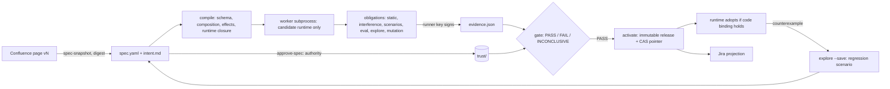

# behaviour-release-factory

An evidence-gated **behaviour-release factory** for chat-driven trading-message engines
(client chat → RFQ capture → trader routing → chat suggestions). Coding agents implement; a
separate, protected system decides whether a change may ship.

The unit of delivery is a **behaviour release**: approved intent + executable profile + consumer
contracts + scenarios + labelled corpus, compiled against the exact runtime code it will execute,
qualified by runner-signed evidence, and activated by compare-and-swap.



## Layout

| Path | Owner | Contents |
|---|---|---|
| `runtime/` | builder | Reference engine: inbox/outbox, RFQ state machine, crash-safe effect protocol, profile-selected components with declared contracts and effects |
| `behaviours/<id>/` | builder (spec: product owner) | `intent.md` (approved-page snapshot), `spec.yaml` (requirements → verifications → work items), `profile.json`, `contracts/`, `scenarios/`, `corpus.jsonl` |
| `factory/` | factory (control release) | compiler, lab, evaluation, mutation, worker, runner, gate, activation, impact, atlassian, isolation, adversarial, cli |
| `policy/` | authority (pinned) | `policy.yaml` (desks → permitted destinations, stage effects, obligations, statistical floors, promotion rules, Jira mapping), `builder-boundary.yaml` |
| `sandbox/` | builder-proposable, prover-checked | OpenShell policy the implementation agent runs under |
| `trust/`, `state/`, `build/` | authority / runtime / generated | runner key + pins + approvals; release store + runtime DBs; packages + evidence (all gitignored) |

Destinations use two schemes: `bus:` (trader-facing message bus topics) and `chat:` (outbound chat
suggestions). Bind them to your own transports in the engine's publish capability.

## Design principles and where they live

| Principle | Implementation |
|---|---|
| The spec page owns intent, Git owns the executable form, Jira owns delivery state | `spec-snapshot` binds page + version + digest; the compiler refuses any intent that doesn't match the approved digest; `jira-plan` derives state from gate/activation facts, reconciles by stable label and never rewrites human-owned fields |
| Configuration is executable behaviour, part of a larger contract | Profile, requirements, contracts, scenarios and corpus compile into one canonical package; its digest is the candidate's identity |
| Compile composition, not JSON | `static:composition` (text properties each stage requires/provides, parser universe, converter scheme ↔ destination, contract fields); `static:effects` (destinations ⊆ desk policy, component effects ⊆ stage policy) |
| Behaviours must not interfere | Exact check on rooms × firms × keyword-any, with a concrete witness message; regex patterns fall back to corpus search and report residual uncertainty as INCONCLUSIVE |
| Challenge sequences, not calls | `lab.py`: at-least-once transport, crash points (mid-process, before transport ack, after publish), trader-ack replay, release switches; Hypothesis `find` returns the *shrunk* counterexample |
| Check business invariants | I1 no duplicate external effect · I2 a cancelled RFQ never reactivates or re-routes · I3 raw text immutable · I4 only permitted destinations · I6 no silent loss · I7 consumer contract · I8 in-flight conversations stay pinned |
| An unknown outcome is not a failure | Effects go PENDING → IN_FLIGHT → SENT; after a crash IN_FLIGHT becomes UNKNOWN and is never blindly re-published |
| Tests must reject wrong code | 11 domain mutants (reactivated cancellation, blind republish, early transport ack, dropped pin, inverted side, wrong instrument mapping…) applied only within the behaviour's runtime closure; survivors fail, stale mutants are INCONCLUSIVE |
| No single misleading score | Per-slice 95% Wilson lower bound against protected floors, zero-harm slices as exact invariants, and a one-sided exact McNemar test against the live baseline per slice |
| Evidence is bound to the exact candidate and produced independently | The worker runs candidate code in a subprocess on a snapshot; the parent signs `{candidate digest, runtime file digests, evaluator digest, policy digest, records}` with a key the builder never holds |
| The gate fails closed | Missing obligation → INCONCLUSIVE; any failure, bad signature, stale/changed artifact, unapproved contract, or unpinned policy or evaluator → FAIL |
| Classify by behaviour and authority, not diff size | `runtime` vs `behaviour` class by runtime closure; `new_destination` and `trigger_scope_widened` flags; policy says what may auto-promote, otherwise a candidate-bound, expiring promotion approval is required |
| Activation is transactional and observable; rollback cannot retract | Immutable releases; generation CAS; the gate re-runs at activation; adoption only when deployed code matches the release's runtime binding; a shadow engine with a shadow-only publisher; rollback revokes and reports published effects and moved conversations |
| Context and impact | The `context` task packet carries provenance; `impact` selects exactly the releases whose runtime closure changed (dynamic imports widen to the whole tree) |
| Hooks are feedback, not authority | Claude Code PreToolUse/Stop hooks (`.claude/settings.json`); the authority is the OpenShell sandbox, proven ⊆ the pinned boundary by `openshell-prover` |
| Test the gate itself | `qualify-gate`: 22 adversarial cases, each with an expected outcome **and** reason |
| Gate the merge candidate, not a stale PR head | `.github/workflows/factory-gate.yml` runs on `pull_request` and `merge_group` |

## Run it

Requires Python 3.14 and `uv`. Optional: `openshell-prover` on `PATH` or at `.tools/bin/` for
`sandbox-check`. Download it from the [OpenShell releases](https://github.com/NVIDIA/OpenShell/releases),
or build it in an OpenShell checkout with `cargo build --release -p openshell-prover-cli --features prebuilt-z3`.

```bash
F="uv run python -m factory"
rm -rf build state trust                          # clean slate

$F trust-init                                     # authority: runner key, pin policy/evaluator/boundary
$F approve-spec ust-rfq-nyc  --by product-owner   # authority: approve meaning
$F approve-spec gilt-rfq-ldn --by product-owner

$F compile ust-rfq-nyc && $F evidence ust-rfq-nyc && $F gate ust-rfq-nyc
$F activate ust-rfq-nyc --mode live --by release-bot

$F compile gilt-rfq-ldn && $F evidence gilt-rfq-ldn
$F activate gilt-rfq-ldn --mode shadow --by release-bot
$F feed examples/feed-morning.jsonl --instance i1 && $F shadow-report --instance i1
$F activate gilt-rfq-ldn --mode live --by release-bot

$F context gilt-rfq-ldn                           # task packet for the next change
$F impact --runtime-root /path/to/candidate       # which live releases a runtime change invalidates
$F explore gilt-rfq-ldn --runtime-root /path/to/candidate --save   # minimised counterexample -> regression scenario
$F rollback gilt-rfq-ldn --by oncall              # revoke; report unretractable effects
$F jira-plan --actual examples/jira-snapshot.json
$F sandbox-check
$F qualify-gate                                   # ~45s
```

Builder loop (inside the sandbox, no key): `context` → edit → `check` (unsigned, the same obligations
minus mutation) → `explore --save`. The Stop hook refuses completion while any behaviour or the
runtime has changed since its last check.

`FACTORY_ROOT` selects the workspace; `FACTORY_RUNNER_KEY` (hex) supplies the runner key in CI. All
`FACTORY_*` variables are scrubbed from the worker's environment.

## Qualify your own engine

1. Implement the seams in `runtime/`: register components with their data contracts and effects,
   accept releases via the `Releases` protocol, and publish only through the engine's capability check.
2. Describe each desk or behaviour under `behaviours/<id>/`, and its permitted destinations in `policy/policy.yaml`.
3. Replace or extend the domain mutants in `factory/mutation.py` with faults that matter to your engine.
4. Run `qualify-gate` on your historical defects before enabling any autonomous promotion lane.

## What has been verified

- Both example behaviours: 17/17 obligations pass. All applicable mutants are killed (10 per behaviour); `pin-dropped` is caught only by release-switch exploration.
- `qualify-gate`: 22/22. Covers stale evidence, post-verification edits, forged results, a skipped scenario and a skipped eval, a removed requirement, a lowered threshold, an altered evaluator, wrong routing, an over-broad trigger, a composition hole, three runtime defects and an extraction regression. It also holds scope widening and runtime changes for authority (and PASSes them with approval), and checks sandbox containment, widening and boundary tampering.
- Lifecycle:
  - Shadow activation diverged only on the new desk's messages; promotion cleared the shadow pointer.
  - A defective recovery was shrunk to a one-message counterexample and saved as a regression, which passes on the fixed runtime.
  - Impact isolated a gilt-only change from the UST release.
  - Rollback reported the published effects; pinned conversations continued on the restored release.
  - The Jira plan was correct against a snapshot.
  - Hooks blocked policy, trust and factory writes, including path traversal.
- `openshell-prover`: the builder policy is `within_boundary` over filesystem, network L4/REST, process and Landlock. A route to Jira gives `exceeds_boundary`; a `trust/` read gives `unsupported`. Both fail closed.

## Limits

- **Reference engine.** `runtime/` is a compact reference implementation. SQLite and JSONL sinks stand in for a production config store and transports; the CAS maps onto any store with an atomic conditional update keyed on a generation.
- **No live-model path.** The parser is rules-based. The paired evaluation compares profiles on the candidate runtime, not baseline runtime against candidate runtime.
- **Small example corpora.** With 6–10 conversations per slice, Wilson lower bounds are about 0.61–0.72, which is weak statistical evidence. Grow the corpora before tightening the floors.
- **Worker isolation is a subprocess.** Secrets are scrubbed from its environment, but a same-UID process can read its parent's environment. In CI, run the worker inside an OpenShell sandbox (no network, read-only tree).
- **Not exercised against live services.** The Atlassian adapters (Confluence fetch, Jira fetch/apply) haven't been run against a live tenant; plan computation is verified offline. The CI workflow's structure was validated but it hasn't been run on GitHub.
- **Registry imports aren't tracked for impact.** Module-level side effects in unselected component modules are not followed. Dynamic import/exec widens impact to the whole runtime tree.
- **Every factory code change is a control release.** Evidence fails until the authority re-runs `trust-init`. Approvals are protected by access control on `trust/`; the upgrade path is signed governance digests.

## License

Apache License 2.0. See [LICENSE](LICENSE).
